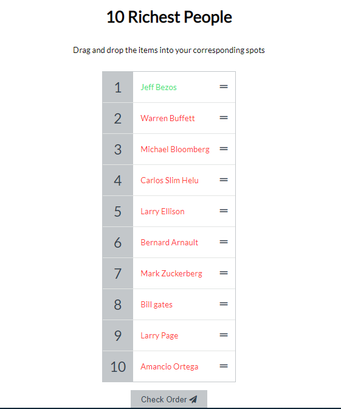

# javascript-sortable-list
Javascript Sortable List
This is a simple list of the Ten richest people. You can drag each name to a desired position then check whether the order is correct. If correct, the color changes to green
You can customize it to a list of whatever kind of items you want.

### A screenshot of user interface below

